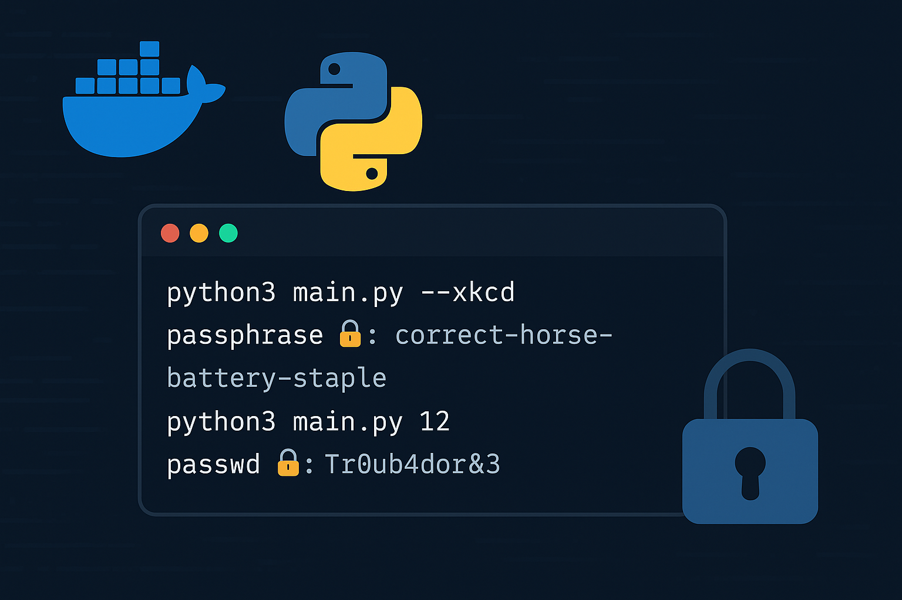

# Python Password generator =^^= Generador de Contraseñas en Python



**Updated to exclude, include, special character, numbers, symbols**
# python3 main.py 
# usage: main.py [-h] [--no-numeros] [--no-simbolos] [--no-especiales] longitud
# sample: 
- python3 main.py 13  **All characters included**
- python3 main.py 12 --nos **All characters except symbols 12 lenght**
- python3 main.py 15 --nos --noe **15 Characters no symbols and no special characters**
- python3 main.py 18  --non --noe --nos **18 Characters, only letters**


**My own python password generator**

# Usage for the legacy version, bpwd.py:

**python3 bpwd.py #lenght of the desired password >=4 (I use a zsh alias, px:**)

# Enhanced Password Generator with XKCD-Style Passphrases

## Overview
This enhanced version of your password generator now supports both traditional random character passwords AND XKCD-style memorable passphrases using random words.

## What is XKCD-Style Password?
Based on the famous [XKCD comic #936](https://xkcd.com/936/), XKCD-style passwords use multiple random common words instead of random characters. They are:
- **More secure**: Higher entropy through word combinations
- **More memorable**: Easier to remember than random characters
- **Easier to type**: No complex character combinations

Example: `correct-horse-battery-staple` vs `Tr0ub4dor&3`

## Features

### Traditional Mode (Original)
- **Choose to include/exclude numbers**: Use `--no-numeros` or `--non` to exclude numbers (0-9)
- **Choose to include/exclude symbols**: Use `--no-simbolos` or `--nos` to exclude basic symbols (!@#$%^&*)
- **Choose to include/exclude special characters**: Use `--no-especiales` or `--noe` to exclude special characters

### XKCD Mode (New!)
- **Word-based passphrases**: Uses EFF's large wordlist (7,776 words)
- **Customizable word count**: Choose how many words to use
- **Custom separators**: Use any character to separate words
- **Capitalization**: Option to capitalize first letter of each word
- **Add numbers**: Append random numbers for extra security
- **Add symbols**: Append random symbols for extra security

## Usage Examples

### XKCD-Style Passphrases

#### Basic XKCD passphrase (5 words):
```bash
python3 main.py --xkcd
```
Output: `passphrase 🔐: reprogram-fleshed-sensuous-mortify`

#### XKCD with capitalization and numbers:
```bash
python3 main.py --xkcd --capitalizar --agregar-numeros
```
Output: `passphrase 🔐: Underpay-Circle-Trough-Bakery-92`

#### XKCD with custom separator and more words:
```bash
python3 main.py --xkcd --palabras 5 --separador "_"
```
Output: `passphrase 🔐: tapestry_delighted_fleshy_liability_dipper`

#### XKCD with all options:
```bash
python3 main.py --xkcd --palabras 6 --separador "." --capitalizar --agregar-numeros --agregar-simbolos
```
Output: `passphrase 🔐: Eraser.Entail.Scouring.Curtsy.Library.Carload.48.$`

### Traditional Random Character Passwords

#### Basic usage (includes all character types):
```bash
python3 main.py 12
```
Output: `passwd 🔐: 08*wgSOfYXlt`

#### Exclude numbers:
```bash
python3 main.py 12 --no-numeros
# or using the short form:
python3 main.py 12 --non
```
Output: `passwd 🔐: KPn%i,,'@@~!`

#### Only letters:
```bash
python3 main.py 12 --non --nos --noe
```
Output: `passwd 🔐: QOuaOeNoAyxq`

## Command Reference

### XKCD Mode Options
- `--xkcd`: Enable XKCD-style passphrase generation
- `--palabras N`: Number of words to use (default: 4)
- `--separador "X"`: Character to separate words (default: "-")
- `--capitalizar`: Capitalize first letter of each word
- `--agregar-numeros`: Add random numbers at the end
- `--agregar-simbolos`: Add random symbols at the end

### Traditional Mode Options
- `longitud`: Length of password (required for traditional mode)
- `--no-numeros` / `--non`: Exclude numbers
- `--no-simbolos` / `--nos`: Exclude symbols  
- `--no-especiales` / `--noe`: Exclude special characters

## Security Considerations

### XKCD Passphrases
- **4 words**: ~44 bits of entropy (very secure)
- **5 words**: ~55 bits of entropy (extremely secure)
- **6 words**: ~66 bits of entropy (overkill for most uses)

### Traditional Passwords
- **12 characters**: ~60-78 bits depending on character set
- **16 characters**: ~80-104 bits depending on character set

## Word List
The generator uses the EFF's large wordlist containing 7,776 carefully selected words that are:
- Common and recognizable
- Easy to spell and remember
- Free of profanity and offensive content
- Optimized for security (no prefix words)

If the EFF wordlist file is not found, the generator falls back to a basic built-in word list.

## Tips for XKCD Passphrases
1. **4 words** is usually sufficient for most accounts
2. **Use capitalization** for systems requiring mixed case
3. **Add numbers/symbols** only if required by password policies
4. **Choose memorable separators** like "-", "_", or "."
5. **Practice typing** your passphrase a few times to build muscle memory


#Changelog#
**Added the spanish word list**
- nl -v 11111 -n ln wordlist.txt >> es.txt
- awk '!seen[$2]++'  temp1.txt temp2.txt| sort -k2 #Sort by second field
**For full symmetric difference**
awk 'NR==FNR {unique[$2]++; print; next} !($2 in unique) {print}' todases.txt es.txt | sort -k2 > merged.txt
- docker build -t passwd .

